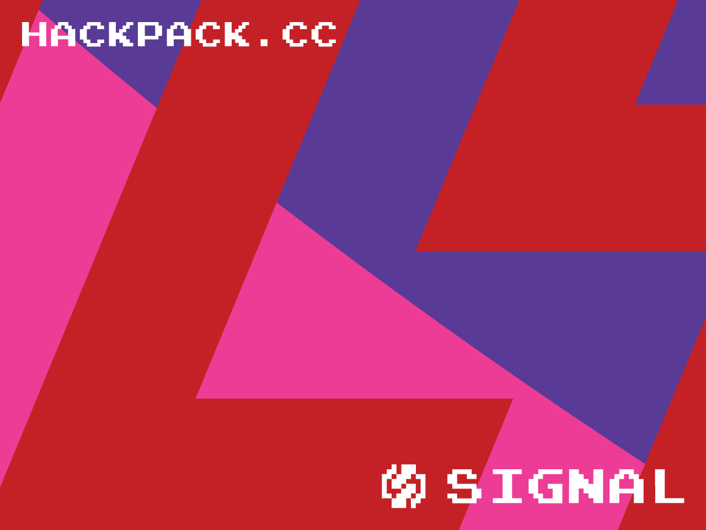

<div align="center">

# 🌈 Hackpack v4 Firmware

```diff
+ 🚀 Your Ultimate Python Development Platform! 
+ 💻 Powered by Raspberry Pi
+ 🎨 With RGB Visual Feedback
+ 🔌 And USB Payload Creation
```

[](https://opensource.org/licenses/MIT)
[](https://www.raspberrypi.com/)
[](https://www.raspberrypi.com/software/)



</div>

## 🚀 What is Hackpack?

Hackpack v4 is your comprehensive Python development platform! Built for the Raspberry Pi Zero W and Zero 2W, it transforms your device into a powerful portable Python workstation with integrated development tools, visual feedback, and USB payload capabilities.

## 💾 Installation

1. **Clone the Firmware**
   ```bash
   cd ~
   git clone https://github.com/yourusername/hackpack-v4-firmware.git
   cd hackpack-v4-firmware
   ```

2. **Run Install Script**
   ```bash
   sudo ./bin/install.sh
   ```
   The LED will pulse blue during installation.
   When installation completes:
   - 🟢 Green flash = Success
   - 🔴 Red flash = Error

3. **First Boot**
   - Reboot your Pi: `sudo reboot`
   - LED will show startup pattern
   - Press A button to test (opens IPython)

## 🎯 Feature Highlights

### 🐍 Python Power Tools

```diff
+ 🔵 A Button: IPython Shell
+ 🟢 B Button: Run Python File
+ 🔴 X Button: Code Quality
+ 🟣 Y Button: USB Payloads
+ ⚪ Start: Jupyter Notebook
+ ⚫ Select: Stop Process
```

### 🌈 RGB Status Lights

```diff
+ 🌊 Cyan Pulse: Running
+ 🟣 Purple Glow: Stalled
+ 🟢 Green Flash: Success
+ 🔴 Red Flash: Error
+ 🔵 Blue Shine: Processing
```

### 🛠️ Development Arsenal

<details>
<summary>📚 Interactive Development</summary>

```diff
+ IPython: Advanced Python REPL
+ Jupyter: Notebook Interface
+ Rich: Beautiful Terminal Output
+ Ptpython: Better Python Shell
```
</details>

<details>
<summary>🎯 Code Quality</summary>

```diff
+ Black: Code Formatting
+ Pylint: Code Analysis
+ MyPy: Type Checking
+ Pytest: Testing Framework
+ Coverage: Code Coverage
```
</details>

<details>
<summary>🌐 Web Development</summary>

```diff
+ FastAPI: Modern Web Framework
+ Uvicorn: ASGI Server
+ WebSockets: Real-time Comms
+ Requests: HTTP Client
+ HTTPX: Async HTTP
```
</details>

<details>
<summary>📊 Data Science</summary>

```diff
+ NumPy: Numerical Computing
+ Pandas: Data Analysis
+ Matplotlib: Visualization
+ SciPy: Scientific Computing
+ Jupyter Lab: Data Workspace
```
</details>

<details>
<summary>🔌 USB Tools</summary>

```diff
+ PyUSB: USB Communication
+ HIDAPi: HID Devices
+ Payload Generator
+ Device Emulation
+ Quick Deployment
```
</details>

## 🔧 Installation

### Step 1: Choose Your Hardware

#### 🔵 Raspberry Pi Zero W
```markdown
📥 Use 32-bit Raspberry Pi OS
🔗 Download: raspberrypi.com/software
📦 Select: "Raspberry Pi OS with desktop"
```

#### 🔴 Raspberry Pi Zero 2W (Recommended)
```markdown
🚀 Better performance for data processing
📥 Use 64-bit Raspberry Pi OS
🔗 Download: raspberrypi.com/software
📦 Select: "Raspberry Pi OS (64-bit) with desktop"
```

### Step 2: Install the Firmware

1. Clone this repository:
```bash
git clone https://github.com/YourUsername/hackpack-v4-firmware.git /home/pi/firmware
```

2. Run the installer:
```bash
sudo bash /home/pi/firmware/bin/install.sh
```

🎯 The firmware will automatically detect your Pi model and apply the optimal configuration!

## 🔧 Features

### 🔍 Security Tools
- Network Scanning & Analysis
  - Discover devices on your network
  - Analyze network traffic
  - Monitor IoT device communications
- Security Testing
  - Automated security assessments
  - Protocol analysis
  - Vulnerability scanning

### 🌐 Development Environment
- API Development
  - FastAPI with automatic OpenAPI docs
  - RESTful API templates
  - API testing tools
- Code Quality
  - Automated formatting with black
  - Linting with pylint
  - Unit testing with pytest

### 📊 Data Analysis
- SQLite database support
- Jupyter notebooks
- Data visualization tools

## 🛠️ Development

### Prerequisites
- Raspberry Pi Zero W or Zero 2W
- Raspberry Pi OS (32/64-bit)
- Basic Linux knowledge

### Quick Start Guide
```bash
# Install the platform
git clone https://github.com/Anon23261/hackpack-v4-firmware.git /home/pi/firmware
sudo bash /home/pi/firmware/bin/install.sh

# Start using the tools
source ~/venv/bin/activate  # Activate Python environment

# Network scanning
sudo python3 ~/projects/scan_network.py

# Start the API server
cd ~/projects/api
python3 example_server.py
```

## 🤝 Contributing

We welcome contributions! Feel free to:
- 🐍 Add new Python tools
- 🌐 Improve development workflows
- 📊 Enhance development features
- 🐛 Fix bugs
- 📚 Improve documentation

## 📜 License

This project is licensed under the MIT License - see the LICENSE file for details.

---

<div align="center">

### 🐍 Python Development Platform 💻

</div>

## 📚 Detailed Documentation

## 📂 Project Organization

```diff
+ 📁 /home/pi/
! ├── 📂 firmware/          # System Core
! ├── 📂 venv/              # Python Environment
! └── 📂 projects/          # Your Workspace
!     └── 📂 payloads/      # USB Scripts

# Key Directories
+ firmware/: Core system files
+ venv/: Isolated Python environment
+ projects/: Your development space
+ payloads/: USB automation scripts
```

```
/home/pi/
├── firmware/          # Core system files
├── venv/              # Python virtual environment
└── projects/          # Your Python workspace
    └── payloads/      # USB payload scripts
```

### Quick Access Buttons

#### Development Tools
- A Button: Launch IPython shell
- B Button: Run current Python file
- X Button: Run code quality checks
  * Black formatting
  * Pylint analysis
  * Pytest execution
- Y Button: USB payload generator
- Start Button: Launch Jupyter Notebook
- Select Button: Stop current process

#### Visual Feedback
- Cyan blinking: Process running
- Purple solid: Process stalled
- Green: Success
- Red: Error/Stop
- Blue: Processing

#### Development Packages
- Interactive: IPython, Jupyter
- Quality: Black, Pylint, MyPy, Pytest
- Web: FastAPI, Uvicorn, WebSockets
- Data: NumPy, Pandas, Matplotlib
- Utils: Rich, Tqdm, Python-dotenv

## 🚀 Quick Start Guide

### 🎮 Button Controls

```diff
! A Button (Blue)
+ Launch IPython for quick coding
+ Access advanced REPL features
+ Get instant code completion
+ View rich documentation

! B Button (Green)
+ Run current Python file
+ See output in terminal
+ Get visual execution feedback
+ Auto-reload on changes

! X Button (Red)
+ Format with Black
+ Check with Pylint
+ Run unit tests
+ Verify type hints

! Y Button (Purple)
+ Generate USB payloads
+ Test HID emulation
+ Quick script deployment
+ Device interaction

! Start Button (White)
+ Launch Jupyter Notebook
+ Web-based development
+ Interactive data analysis
+ Rich output display

! Select Button (Stop)
+ Stop current process
+ Clean process shutdown
+ Reset LED status
+ Clear terminal
```

### 🔧 Development Workflow

```bash
# Activate environment
source ~/venv/bin/activate

# Create new Python file
touch ~/projects/my_script.py

# Edit and run (B Button)
vim ~/projects/my_script.py

# Check code quality (X Button)
black .
pylint *.py
pytest

# Interactive development (A Button)
ipython

# Create USB payload (Y Button)
cd ~/projects/payloads
python3 generate_payload.py
```
